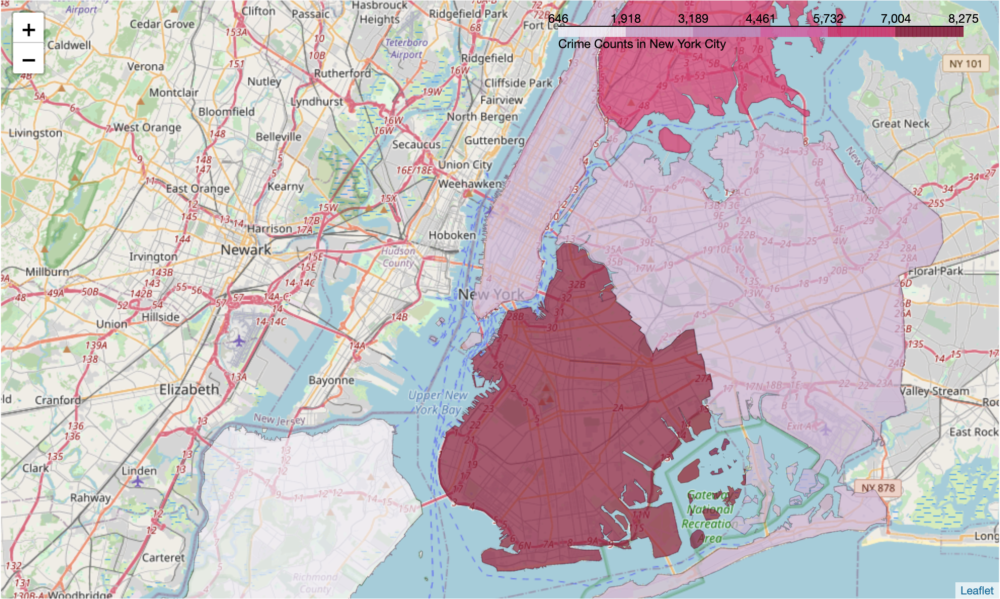
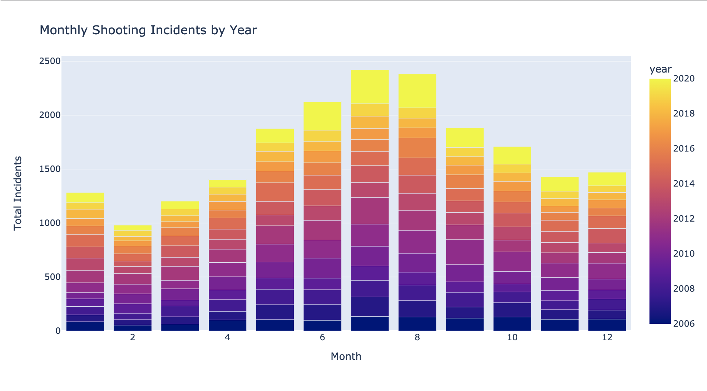

# NYPD Shooting Incidents Analysis
 

## Table of Contents
1. [Installation](#installation)
2. [Project Motivation](#motivation)
3. [File Descriptions](#files)
4. [Results](#results)
5. [Licensing, Authors, and Acknowledgements](#licensing)

## Installation
In this project, there are no requirements for libraries beyond the Anaconda distribution of Python.
The code is recommended to be run using Python version 3.*.

The libraries used: 
* numpy 
* pandas 
* matplotlib.pyplot 
* seaborn 
* folium 
* scikit learn

## Project Motivation

Gun shooting has long been a social security issue in the US. Every year, a large number of victims were injured or 
killed in New York City due to a shooting incident. In this regard, analyzing and learning from the historic incident 
data is meaningful and helpful for both the police departments and the society as a whole. 

In this project, there are two analysis sections, exploratory data analysis(EDA) and predictive analysis. The goal of 
this project includes providing a descriptive summary on shooting incidents, showing a big picture of the perpetrators 
and the victims, and helping NYPD classify perpetrators' age groups based on the information in hand.

### Exploratory Data Analysis(EDA)
To explore the nature of shooting incidents in New York City, this project tries to answer three questions: 
1. **When** does shooting usually happen? 
2. **Who** conducts shooting and who gets targeted? 
3. **Where** are the hotspots where shootings frequently happen ? 

### Predictive Analysis
I employed three classification algorithms for modeling perpetrator's age groups, namely DecisionTree, Random Forest, and Multi-layer Perceptron. 
The reason for choosing these three algorithms is that they are all good at handling large datasets and perform well on classification tasks. 
The idea to use 3 algorithms for the same task is to explore and compare among the 3 classifiers.

## File Descriptions
#### Datasets:
The dataset `NYPD_Shooting_Incident_Data__Historic_.csv` is a collection of every shooting incident that occurred in NYC going back to 2006 through May 2021, 
including information about the victim, the perpetrator, the location, and the time of occurrence. This dataset 
is a real-world dataset obtained from [NYC Open Data](https://opendata.cityofnewyork.us/). 
More descriptive information can be found [here](https://data.cityofnewyork.us/Public-Safety/NYPD-Shooting-Incident-Data-Historic-/833y-fsy8).

#### Coding:
There are two `.py` files and one notebook file available here to showcase work related to the above questions. The 2 utility `.py` files are functions deployed for EDA and predictive analysis.
For the whole workflow, results, and interpretation from a technical view, please refer to the `airbnb_analysis.ipynb`.

#### Results and Report:
Since interactive maps in the notebook don't work in Github repository, you may refer to `nypd_shooting_analysis.html`
for an integrated notebook report rendered by nbviewer.

## Results
The main findings and report can be found in `nypd_shooting_analysis.html`

## Licensing, Authors, and Acknowledgements
I must give credit to Stack Overflow for the coding part and Medium for the statistical part. 
All the code here are open to the public. Thus, feel free to use it as you would like.
